---

---

# CBW227912 - Leveraging Speckle in Dynamo

Matteo Cominetti

Join this breakout session and learn how to build an extension! We'll examine an existing one and understand how it works. You'll have the opportunity to modify it, break it, and fix it. We'll see how extensions can have a user interface or just run in the background. We'll see how extensions can be used to interact with nodes on the canvas, with the graph itself and with the Dynamo View Model. We'll also see how to set up Visual Studio to automatically build and bundle the extension with other packages for release on the package manager.


## Requirements

- Visual Studio 2015 or 2017
- Dynamo 2.0.1


## Anatomy of an Extension

From `CBW227912 - Leveraging Speckle in Dynamo\HelloDynamo\` open `HelloDynamo.sln` in Visual Studio.

The project HelloDynamo inside the solution has already been configured with all the required files and settings to run a simple extension (thanks Eric!). Let's see them!

### Project Settings


We are of course building to Class Library, and note that the **.NET Framework has been set to 4.5**, that's because Dynamo itself is using v4.5, and therefore it can't be higher than that.

### References


References are managed via NuGet, if you were to start a project from scratch you'll just need to add:

- `DynamoVisualProgramming.Core`

- `DynamoVisualProgramming.WpfUILibrary`

as the others will be added automatically as dependencies.

Always remember to set these new references to `Copy Local = False`.


### Build Events

We'll go thorough build events later in this workshop, but just for you to know, there is some magical code in your `HelloDynamo.csproj` file that automatically copies the built files to the right places, so that you don't have to do it manually each time!

### Start Action

Upon debugging we'll run our extension inside DynamoSandbox. This is a version of Dynamo that runs standalone and doesn't have any Revit dependencies and therefore Revit elements/nodes. It is installed together Dynamo for Revit and you can find it in: `C:\Program Files\Dynamo\Dynamo Core\2\DynamoSandbox.exe`

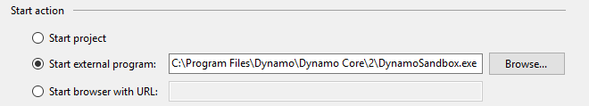

### Project Structure

There's not really a project structure to follow, but let's see how HelloDynamo has been set up.

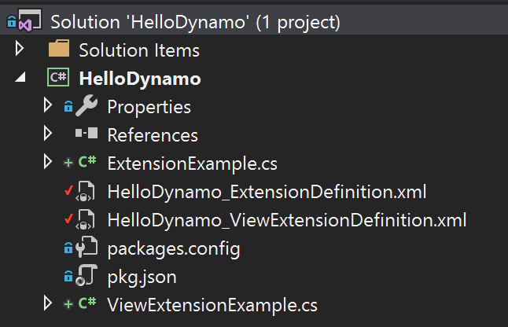

This sample project contains both a sample Extension and a sample ViewExtension therefore we can find:

- `ExtensionExample.cs` is the code for a sample Extension
- `ViewExtensionExample.cs` is the code for a sample ViewExtension
- `HelloDynamo_ExtensionDefinition.xml` is a manifest file which tells Dynamo which class to instantiate to start the Extension
- `HelloDynamo_ViewExtensionDefinition.xml` is a manifest which tells Dynamo which class to instantiate to start the ViewExtension

It also contains a:

- `packages.config` used by NuGet
- `pkg.json` used to define a Dynamo package


## Hello Dynamo!

Now let's have a look at the code.

### The IExtension and IViewExtension interfaces

The two classes we saw above are respectively implementing the `IExtension ` and `IViewExtension` interfaces and the methods/properties they specify.

```c#
using System.Windows;
using Dynamo.Extensions;

namespace HelloDynamo
{
  public class ExtensionExample : IExtension
  {
    public string UniqueId => "3B234622-43B7-4EA8-86DA-54FB390BE29E";

    public string Name => "Hello World";

    public void Dispose() { }

    public void Ready(ReadyParams rp)
    {
      MessageBox.Show("Extension is ready!");
    }

    public void Shutdown() { }

    public void Startup(StartupParams sp) { }
  }
}

```

```c#
using System.Windows;
using Dynamo.Wpf.Extensions;

namespace HelloDynamo
{
  public class ViewExtensionExample : IViewExtension
  {
    public string UniqueId => "5E85F38F-0A19-4F24-9E18-96845764780C";

    public string Name => "Hello Dynamo";

    public void Loaded(ViewLoadedParams p)
    {
      MessageBox.Show("ViewExtension has loaded!");
    }

    public void Dispose() { }

    public void Shutdown() { }

    public void Startup(ViewStartupParams p) { }
  }
}

```

At startup Dynamo calls two methods on the extensions:

- `Startup(StartupParams)` or `Startup(ViewStartupParams)` called when Dynamo starts loading
- `Ready(ReadyParams)` or `Loaded(ViewLoadedParams)` called when Dynamo is finished loading

Referring then to this diagram, you should now have an idea of what will happen when we debug (image courtesy of the Dynamo team):


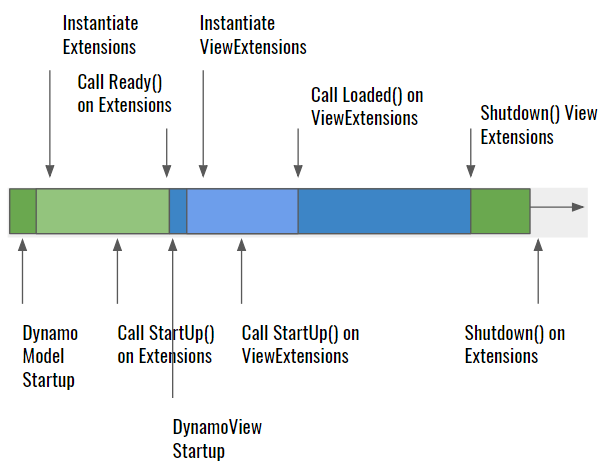

**Test run #1**

Let's click F5 and Debug to see this in action...

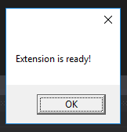

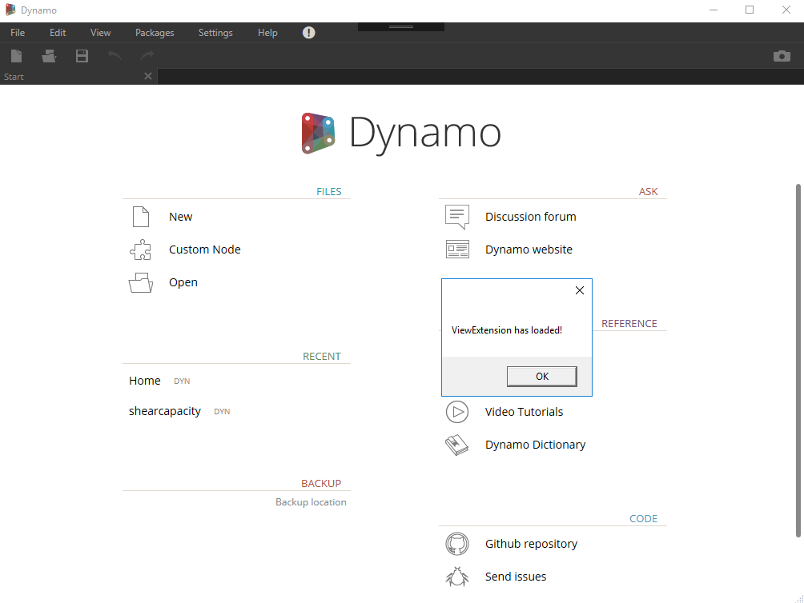

As you can se the StartUp event in the extension preceeded the one of the view extension.

#### Params

The parameters passed in the `StartUp`, `Loaded` and `Ready` events are what will give us access to all the powerful things extensions can do. Below some of the main ones:

**StartupParams**

- AuthProvider
- Preferences
- PathManager
- LibraryLoader
- CustomNodeManager
- DynamoVersion

**ViewStartupParams**

- All the above (it inherits from StartupParams)
- ExtensionManager

**ReadyParams**

- WorkspaceModels
- CurrentWorkspaceModel
- CommandExecutive
- NotificationRecieved
- CurrentWorkspaceChanged

**ViewLoadedParams**

- All the above (it inherits from ReadyParams)
- DynamoMenu
- BackGroundPreviewViewModel
- RenderPackageFactory
- DynamoWindow
- CommandExecutive
- AddMenuItem
- SelectionCollectionChanged

### Adding a menu item

Let's see an example, let's add a menu item. This is pretty simple, the `ViewStartupParams.dynamoMenu` field gives us access to to the Dynamo menu, to add a new menu item we just need. :

```c#
      // let's now create a completely top-level new menu item
      extensionMenu = new MenuItem { Header = "AU Workshop" };

      // and now we add a new sub-menu item that says hello when clicked
      var sayHelloMenuItem = new MenuItem { Header = "Say Hello" };
      sayHelloMenuItem.Click += (sender, args) =>
      {
        MessageBox.Show("Hello " + Environment.UserName);
      };
      extensionMenu.Items.Add(sayHelloMenuItem);

      // finally, we need to add our menu to Dynamo
      viewLoadedParams.dynamoMenu.Items.Add(extensionMenu);
```

**Test run #2**

Debug and see our new menu item:

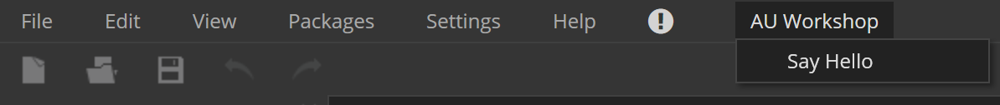      

### MVVM


The Model-View-View-Model pattern is very popular and helps to have a good architecture in our projects, if you’re unfamiliar with it or data binding, here is brief introduction.

The MVVM design pattern is similar to the well known MVC pattern in that the *M* (Model) and *V* (View) are *relatively* the same. The only difference resides between the *C* (Controller) and the *VM* (View Model).

**Model**

Represents the *Data + State + Business logic*. It is not tied to the view nor to the controller, which makes it reusable in many contexts.

**View**

*Binds* to observable variables and actions exposed by the View Model. It is possible for multiple views to bind to a single View Model.

**View Model**

Responsible for wrapping the model and preparing observable data needed by the view. It also provides hooks for the view to pass events to the model. An important thing to keep in mind is that *the View Model is not tied to the view*.

### Tracking changes

Let's now explore another very useful functionality available via the `ViewStartupParams` while making use of the MVVM pattern and data binding. 

With  `ViewStartupParams.CurrentWorkspace` we can access several events:

```c#
viewLoadedParams.CurrentWorkspaceChanged
viewLoadedParams.NotificationRecieved
viewLoadedParams.CurrentWorkspaceModel.NodeAdded
viewLoadedParams.CurrentWorkspaceModel.NodeRemoved
viewLoadedParams.CurrentWorkspaceModel.ConnectorAdded
viewLoadedParams.CurrentWorkspaceModel.ConnectorDeleted
```

Let's edit our ViewExtension to make use of them. Create a `NodeTracker.xaml` window which will contain the list of our tracked events. This will be our **View**.

```xml
<Window x:Class="HelloDynamo.NodeTracker"
        xmlns="http://schemas.microsoft.com/winfx/2006/xaml/presentation"
        xmlns:x="http://schemas.microsoft.com/winfx/2006/xaml"
        xmlns:d="http://schemas.microsoft.com/expression/blend/2008"
        xmlns:mc="http://schemas.openxmlformats.org/markup-compatibility/2006"
        xmlns:local="clr-namespace:HelloDynamo"
        mc:Ignorable="d"
        Title="NodeTracker" Height="450" Width="400">
  <Grid>
    <ListView ItemsSource="{Binding Actions}"></ListView>
  </Grid>
</Window>
```

Where `NodeTracker.xaml.cs` looks like:

```C#
using System.Windows;

namespace HelloDynamo
{
  /// <summary>
  /// Tracks and displays events for node/connector added/removed 
  /// </summary>
  public partial class NodeTracker : Window
  {
    public NodeTracker()
    {
      InitializeComponent();
      this.Closing += NodeTracker_Closing;
    }

    private void NodeTracker_Closing(object sender, System.ComponentModel.CancelEventArgs e)
    {
      //hide window instead of closing it, so we keep tracking in the background
      e.Cancel = true;
      this.Hide();
    }
  }
}
```

Now let's crate a **ViewModel** that will bind to the window and will keep track of the changes to the `CurrentWorkspaceModel`, create a new class `NodeTrackerViewModel.cs`:

```C#
using System;
using System.Collections.ObjectModel;
using Dynamo.Core;
using Dynamo.Extensions;

namespace HelloDynamo
{
  public class NodeTrackerViewModel: NotificationObject, IDisposable

  {
    private ReadyParams readyParams;

    private ObservableCollection<string> _actions = new ObservableCollection<string> ();
    public ObservableCollection<string> Actions { get { return _actions; } set { _actions = value; RaisePropertyChanged("Actions"); } }

    public NodeTrackerViewModel(ReadyParams p)
    {
      readyParams = p;
      
      //subscribing to dynamo events
      readyParams.CurrentWorkspaceModel.NodeAdded += CurrentWorkspaceModel_NodeAdded;
      readyParams.CurrentWorkspaceModel.NodeRemoved += CurrentWorkspaceModel_NodeRemoved;
      readyParams.CurrentWorkspaceModel.ConnectorAdded += CurrentWorkspaceModel_ConnectorAdded;
      readyParams.CurrentWorkspaceModel.ConnectorDeleted += CurrentWorkspaceModel_ConnectorDeleted;

      //making sure the binding is updated when elements are added and removed
      Actions.CollectionChanged += Actions_CollectionChanged;
    }

    private void Actions_CollectionChanged(object sender, System.Collections.Specialized.NotifyCollectionChangedEventArgs e)
    {
      RaisePropertyChanged("Actions");
    }

    private void CurrentWorkspaceModel_ConnectorDeleted(Dynamo.Graph.Connectors.ConnectorModel obj)
    {
      Actions.Add($"Connector between port {obj.Start.Name} and {obj.End.Name} deleted");
    }

    private void CurrentWorkspaceModel_ConnectorAdded(Dynamo.Graph.Connectors.ConnectorModel obj)
    {
      Actions.Add($"Connector between port {obj.Start.Name} and {obj.End.Name} added");
    }

    private void CurrentWorkspaceModel_NodeRemoved(Dynamo.Graph.Nodes.NodeModel obj)
    {
      Actions.Add($"Node {obj.Name} deleted");
    }

    private void CurrentWorkspaceModel_NodeAdded(Dynamo.Graph.Nodes.NodeModel obj)
    {
      Actions.Add($"Node {obj.Name} created");
    }

    public void Dispose()
    {
      //unsubscribing from events
      readyParams.CurrentWorkspaceModel.NodeAdded -= CurrentWorkspaceModel_NodeAdded;
      readyParams.CurrentWorkspaceModel.NodeRemoved -= CurrentWorkspaceModel_NodeRemoved;
      readyParams.CurrentWorkspaceModel.ConnectorAdded -= CurrentWorkspaceModel_ConnectorAdded;
      readyParams.CurrentWorkspaceModel.ConnectorDeleted -= CurrentWorkspaceModel_ConnectorDeleted;
    }

  }
}
```

Each time a node or connector is added or removed we log that event by adding a string to our `Actions` collection, in this case an ObservableCollection so that we can bind it to the `ListView` in the` NodeTracker` window.

Finally let's edit `ViewExtensionExample.cs` to start the tracking and to open the window when the user clicks on a menu item:

```C#
using Dynamo.Wpf.Extensions;
using System;
using System.Windows;
using System.Windows.Controls;

namespace HelloDynamo
{
  /// <summary>
  /// Dynamo View Extension that can control both the Dynamo application and its UI (menus, view, canvas, nodes).
  /// </summary>
  public class ViewExtensionExample : IViewExtension
  {
    public string UniqueId => "5E85F38F-0A19-4F24-9E18-96845764780C";
    public string Name => "Hello Dynamo View Extension";

    private MenuItem extensionMenu;
    private ViewLoadedParams viewLoadedParams;
    
    private NodeTracker _nodeTracker = null;

    public void Startup(ViewStartupParams vsp) { }

    public void Loaded(ViewLoadedParams vlp)
    {
      viewLoadedParams = vlp;
	  //instanciating the window and setting the datacontext to bind it to the viewmodel
      var viewModel = new NodeTrackerViewModel(viewLoadedParams);
      _nodeTracker = new NodeTracker
      {
        Owner = viewLoadedParams.DynamoWindow,
        DataContext = viewModel
      };

      MakeMenuItems();
    }

    public void MakeMenuItems()
    {
      extensionMenu = new MenuItem { Header = "AU Workshop" };

      var sayHelloMenuItem = new MenuItem { Header = "Say Hello" };
      sayHelloMenuItem.Click += (sender, args) =>
      {
         MessageBox.Show("Hello " + Environment.UserName);
      };
      //new menu item for our node tracker
      var nodeTrackerMenuItem = new MenuItem { Header = "Node Tracker" };
      nodeTrackerMenuItem.Click += (sender, args) =>
      {
        _nodeTracker.Show();
      };

      extensionMenu.Items.Add(sayHelloMenuItem);
      extensionMenu.Items.Add(nodeTrackerMenuItem);
      viewLoadedParams.dynamoMenu.Items.Add(extensionMenu);
    }

    public void Shutdown() { }

    public void Dispose() { }
  }
}
```

**Test run #3**

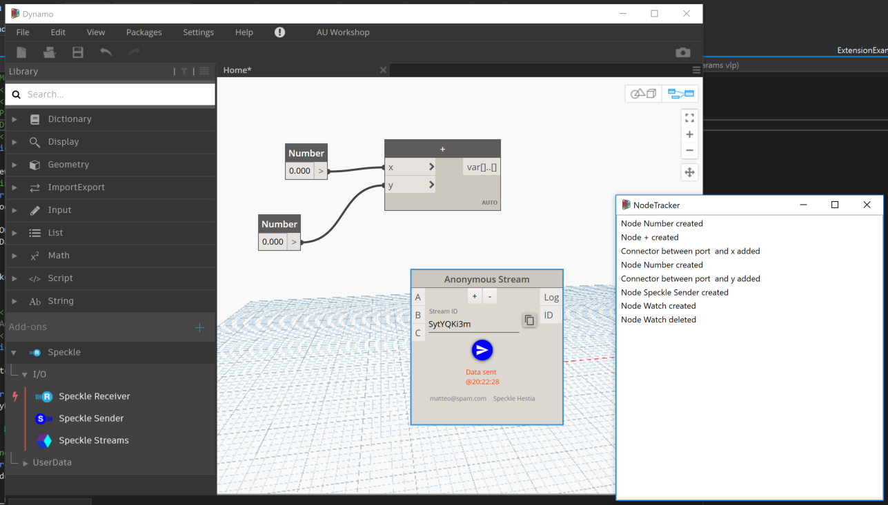


## Speckle!

### What is Speckle?

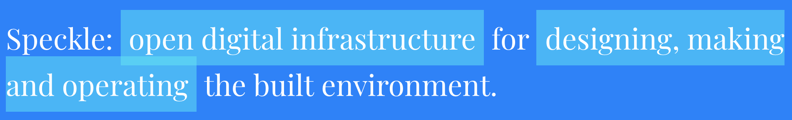

Speckle is an open source data communication protocol and platform for the AEC industry. 

With Speckle data generated in various design tools can be streamed and exchanged via custom integrations (clients) through the Speckle Server, these so far include plugins for:

- Grasshopper
- Rhino
- Dynamo
- Revit (under development)
- Blender
- Unity (experimental)

Let's see a quick example of points and lines exchanged between Dynamo and Grasshopper:


Or the generation of Revit elements from Grasshopper:

https://twitter.com/speckle_works/status/1059799437340491776

Or again the use of Speckle to stream geometry to the Hololens:

https://www.youtube.com/watch?v=MFDeAb54dOc

#### Speckle Community

Speckle is powered by a growing community of 400+ contributors and users, you can join the discussion by entering the Slack channel:

https://slacker.speckle.works/

#### Installing Speckle for Dynamo

Installing Speckle for Dynamo is very simple, open the package manger and get it from there. The lastest release is v0.0.6(alpha).


Then you can either click Speckle > Manage Accounts or place a new Sender/Receiver node and if you don't have any account you'll be prompted to create one:


#### Show me the code!

All the Speckle code is open source with an MIT license, meaning you can do whatever you want with it! All the code is hosted on [GitHub](https://github.com/speckleworks/).

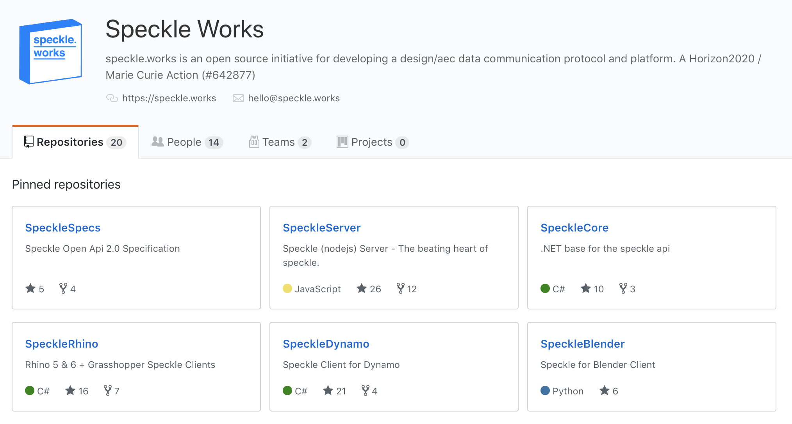


### The Speckle Dynamo ViewExtension

Speckle for Dynamo uses the extensions API in variety of ways, to follow this part of the workshop you can either clone the [SpeckleDynamo](https://github.com/speckleworks/SpeckleDynamo) repository or download it as a zip. The ViewExtension is contained in a separate project named `SpeckleDynamoExtension`.  From there open `SpeckleDynamoExtension.cs`.

#### **Checking for updates**

The first and most simple way the extension is used, is to check for updates:

```c#
public void Loaded(ViewLoadedParams viewLoadedParams)
    {
      //check for updates in the background
      Api.CheckForUpdates();
      ...
```

We are taking advantage of the `Loaded` method to call our`CheckForUpdates()` function, before any node is placed. In order not to slow down the application startup or anything the user might be doing, the function called is asynchronous.

#### Accounts Manager

The second thing this extension does is providing access to the accounts manager, which is a WPF window part of separate project called `SpecklePopup`.

As we have seen earlier, this is done by adding a `MenuItem` to the Dynamo menu that opens a new window.

```c#
speckleAccountsMenu.Click += (sender, args) =>
{
    var window = new SpecklePopup.MainWindow(false)
    {
        Owner = viewLoadedParams.DynamoWindow,
        WindowStartupLocation = System.Windows.WindowStartupLocation.CenterOwner
    };
    window.Show();
};
```

The accounts manager is the window that popped up earlier when we registered. It's not doing anything fancy but it would much more tricky to display/access it without an extension!

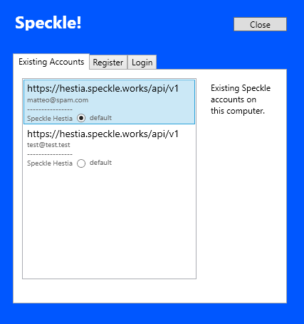


#### Node Manager

The node manager is a handy utility only possible through an extension, let's see it in action first:

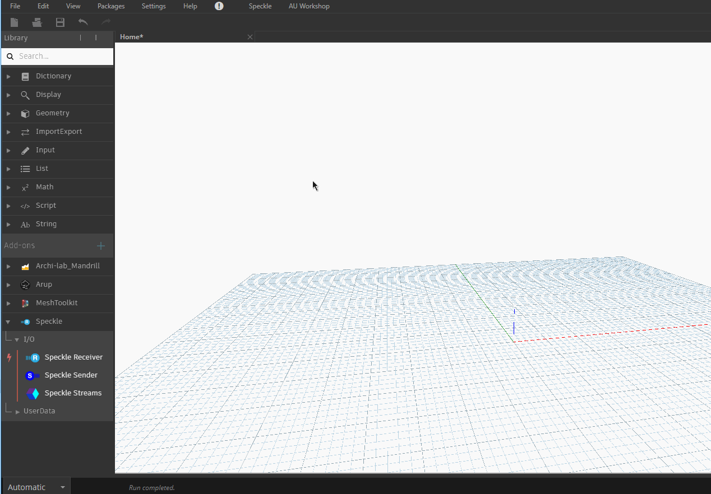

It lets you easily keep track of the speckle nodes on the workspace. As you can see the selection status and node name are kept in sync between the list and the workspace, this is done automatically through binding.

This extension was made in a very similar way to the Node Tracker we wrote earlier, let's see the most important bits.

In `NodeManager.xaml`, the `ListView` is the main UI component (the View):

```xml
    <ListView
      Grid.Row="1"
      ItemsSource="{Binding SpeckleNodes}"
      SelectionMode="Multiple">
      <ListView.ItemContainerStyle>
        <Style TargetType="{x:Type ListViewItem}">
          <Setter Property="IsSelected" Value="{Binding IsSelected, Mode=TwoWay, UpdateSourceTrigger=PropertyChanged}" />
          <Setter Property="IsEnabled" Value="{Binding IsFozen, Mode=TwoWay, UpdateSourceTrigger=PropertyChanged}" />
        </Style>
      </ListView.ItemContainerStyle>
      <ListView.ItemTemplate>
        <DataTemplate>
          <StackPanel Orientation="Horizontal">
            <Label Content="{Binding Name}" />
          </StackPanel>
        </DataTemplate>
      </ListView.ItemTemplate>
    </ListView>
```

In `NodeManagerViewModel.cs` we have our **ViewModel**:

```c#
using Dynamo.Core;
using Dynamo.Graph.Nodes;
using Dynamo.ViewModels;
using Dynamo.Wpf.Extensions;
using System;
using System.Collections.ObjectModel;
using System.Linq;

namespace SpeckleDynamoExtension.ViewModels
{
  public class NodeManagerViewModel : NotificationObject, IDisposable
  {
    private ViewLoadedParams viewLoadedParams;

    private ObservableCollection<NodeModel> _speckleNodes = new ObservableCollection<NodeModel>();
    public ObservableCollection<NodeModel> SpeckleNodes { get { return _speckleNodes; } set { _speckleNodes = value; RaisePropertyChanged("SpeckleNodes"); } }

    public NodeManagerViewModel(ViewLoadedParams p)
    {
      viewLoadedParams = p;

      //subscribing to dynamo events
      viewLoadedParams.CurrentWorkspaceModel.NodeAdded += CurrentWorkspaceModel_NodeAdded;
      viewLoadedParams.CurrentWorkspaceModel.NodeRemoved += CurrentWorkspaceModel_NodeRemoved;
    }

    private void CurrentWorkspaceModel_NodeRemoved(NodeModel obj)
    {
      var type = obj.GetType().ToString();
      if (type == "SpeckleDynamo.Sender" || type == "SpeckleDynamo.Receiver")
      {
        SpeckleNodes.Remove(obj);
      }
    }

    private void CurrentWorkspaceModel_NodeAdded(NodeModel obj)
    {
      var type = obj.GetType().ToString();
      if (type == "SpeckleDynamo.Sender" || type == "SpeckleDynamo.Receiver")
      {
        SpeckleNodes.Add(obj);
      }
    }

    public void ZoomToFitNodes()
    {
      //IsSelected on the NodeModel is not enough, need to call AddToSelectionCommand
      var dynViewModel = viewLoadedParams.DynamoWindow.DataContext as DynamoViewModel;
      var selectedNodes = SpeckleNodes.Where(x => x.IsSelected).ToList();
      Utilities.ClearSelection();
      foreach (var node in selectedNodes)
        dynViewModel.AddToSelectionCommand.Execute(node);
      dynViewModel.FitViewCommand.Execute(null);
    }

    public void DeleteNodes()
    {
      //IsSelected on the NodeModel is not enough, need to call AddToSelectionCommand
      var dynViewModel = viewLoadedParams.DynamoWindow.DataContext as DynamoViewModel;
      var selectedNodes = SpeckleNodes.Where(x => x.IsSelected).ToList();
      Utilities.ClearSelection();
      foreach(var node in selectedNodes)
        dynViewModel.AddToSelectionCommand.Execute(node);
      dynViewModel.DeleteCommand.Execute(null);
    }

    public void Dispose()
    {
      //unsubscribing from events
      viewLoadedParams.CurrentWorkspaceModel.NodeAdded -= CurrentWorkspaceModel_NodeAdded;
      viewLoadedParams.CurrentWorkspaceModel.NodeRemoved -= CurrentWorkspaceModel_NodeRemoved;
    }
  }
}

```

Which instead of containing a collection of strings, as we saw earlier, it contains a list of Dynamo nodes, and since these implement `:NotificationObject` the `IsSelected` and `Name` properties are automatically bound, two ways, with the View.

The `ZoomToFitNodes()` and `DeleteNodes()` methods are called to zoom in or delete the selected nodes and make use of commands exposed via the `DynamoViewModel`.

#### **Node Sender and Node Receiver**

One last example of how speckle is using extensions is given by the Node Sender and Node Receiver. This functionality is quite experimental and please consider it just a proof of what can be achieved combing the powerful extensions API and the real-time data transfer capabilities Speckle offers.

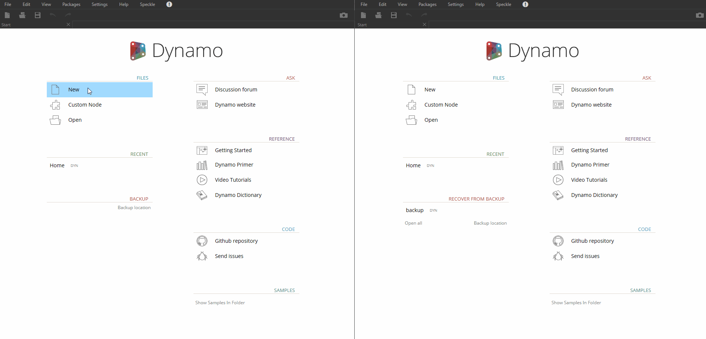


The node sender and node receiver are two windows with a custom style, `Receiver.xaml` and `Sender.xaml`, that bind to `RecevierViewModel.cs` and `SenderViewModel.cs` respectively. If you open them, you'll see a lot of logic that pertains to Speckle. But let's see how the extensions API is being used. 

In `SenderViewModel.cs` the method `Send_Click(object sender, RoutedEventArgs e)` is fired when the send button is clicked, it then takes a list of the selected nodes from the `DynamoViewModel` and serializes it together with their connectors as Dynamo Workspace. This is a bit of a hack we are using to easily then recreate the same nodes, with the same properties and GUIDs on the receiver side.

That is the same method Dynamo uses when saving a a file to disk.

```c#
internal void Send_Click(object sender, RoutedEventArgs e)
{
    Transmitting = true;
    Message = "Sending...";

    //getting seleted nodes
    var dynViewModel = readyParams.DynamoWindow.DataContext as DynamoViewModel;
    var dm = dynViewModel.Model as DynamoModel;
    var sel = readyParams.CurrentWorkspaceModel.CurrentSelection;

    BucketObjects = new List<object>();

    //dynamo serialization settings 	  //https://github.com/DynamoDS/Dynamo/blob/master/src/DynamoCore/Graph/Workspaces/SerializationExtensions.cs
    var engine = dm.EngineController;
    var logger = engine != null ? engine.AsLogger() : null;
    var settings = new JsonSerializerSettings
    {
        Error = (sender2, args) =>
        {
            args.ErrorContext.Handled = true;
            Console.WriteLine(args.ErrorContext.Error);
        },
        ReferenceLoopHandling = ReferenceLoopHandling.Ignore,
        TypeNameHandling = TypeNameHandling.Auto,
        Formatting = Newtonsoft.Json.Formatting.Indented,
        Culture = CultureInfo.InvariantCulture,
        Converters = new List<JsonConverter>
        {
            new ConnectorConverter(null),
            new WorkspaceWriteConverter(null),
            new DummyNodeWriteConverter(),
            new TypedParameterConverter()
        },
        ReferenceResolverProvider = () => { return new IdReferenceResolver(); }
    };

    List<ConnectorModel> connectors = new List<ConnectorModel>();

    //add all the connectors in use just once
    foreach (var node in sel)
    {
        foreach( var conn in node.AllConnectors)
        {
            if (!connectors.Any(x => x.GUID == conn.GUID) && sel.Any(x => x.GUID == conn.Start.Owner.GUID) && sel.Any(x => x.GUID == conn.End.Owner.GUID))
                connectors.Add(conn);
        }
    }

    // using same structure of a WorkspaceModel to reuse built in dynamo json converters
    var workspace = new SpeckleDynamoWorkspace { Nodes = sel.ToList(), Connectors = connectors };
    workspace.View = new ExtraWorkspaceViewInfo
    {
        NodeViews = workspace.Nodes.Select(n => new ExtraNodeViewInfo
                                           {
                                               Id = n.GUID.ToString(),
                                               ShowGeometry = n.IsVisible,
                                               Excluded = n.IsFrozen,
                                               IsSetAsInput = n.IsSetAsInput,
                                               IsSetAsOutput = n.IsSetAsOutput,
                                               Name = n.Name,
                                               X = n.Position.X,
                                               Y = n.Position.Y
                                           }).ToList(),
        X = dynViewModel.CurrentSpaceViewModel.X,
        Y = dynViewModel.CurrentSpaceViewModel.Y,
        Zoom = dynViewModel.CurrentSpaceViewModel.Zoom
    };

    //sending the above as a string to use custom serialization settings
    //there might be a way to do that with native speckleabstracts
    var json = JsonConvert.SerializeObject(workspace, settings);
    var result = ReplaceTypeDeclarations(json);
    BucketObjects.Add(new SpeckleNodeEvent { Json = result});
    UpdateData();
}
```

In `ReceiverViewModel.cs` we have the logic that deserializes that JSON string and recreates the nodes and their connectors, see `UpdateGlobal()`:

```C#

    public virtual void UpdateGlobal()
    {
      var getStream = myReceiver.StreamGetAsync(myReceiver.StreamId, null);
      getStream.Wait();

      Message = "Getting objects";

      var payload = getStream.Result.Resource.Objects.Select(obj => obj._id).ToArray(); //.Where(o => !ObjectCache.ContainsKey(o._id)).


      myReceiver.ObjectGetBulkAsync(payload, "omit=displayValue").ContinueWith(tres =>
      {
        //add to cache
        foreach (var x in tres.Result.Resources)
          ObjectCache[x._id] = x;

        // populate real objects
        SpeckleObjects.Clear();
        foreach (var obj in getStream.Result.Resource.Objects)
          SpeckleObjects.Add(ObjectCache[obj._id]);

        this.Message = "Converting objects";
        ConvertedObjects = SpeckleCore.Converter.Deserialise(SpeckleObjects);

        if (ConvertedObjects.Count == 0)
        {
          this.Message = "";
          Transmitting = false;
        }
        else
          this.Message = "Updating...";


        //add remove nodes/connectors
        foreach (var obj in ConvertedObjects)
        {
          if (obj is SpeckleNodeEvent)
          {
            var specklenodeevent = obj as SpeckleNodeEvent;
            //needs a dispatcher
            readyParams.DynamoWindow.Dispatcher.BeginInvoke((Action)(() =>
            {
              var dynViewModel = readyParams.DynamoWindow.DataContext as DynamoViewModel;
              var dm = dynViewModel.Model as DynamoModel;

              var engine = dm.EngineController;
              var logger = engine != null ? engine.AsLogger() : null;

              var settings = new JsonSerializerSettings
              {
                Error = (sender, args) =>
                {
                  args.ErrorContext.Handled = true;
                  Console.WriteLine(args.ErrorContext.Error);
                },
                ReferenceLoopHandling = ReferenceLoopHandling.Ignore,
                TypeNameHandling = TypeNameHandling.Auto,
                Formatting = Newtonsoft.Json.Formatting.Indented,
                Culture = CultureInfo.InvariantCulture,
                Converters = new List<JsonConverter>{
                    new ConnectorConverter(dm.Logger),
                        new WorkspaceReadConverter(dm.EngineController, dm.Scheduler, dm.NodeFactory, false, false),
                        new NodeReadConverter(dm.CustomNodeManager, dm.LibraryServices, false),
                        new TypedParameterConverter()
                  },
                ReferenceResolverProvider = () => { return new IdReferenceResolver(); }
              };

              var result = ReplaceTypeDeclarations(specklenodeevent.Json, true);
              var workspace = JsonConvert.DeserializeObject<SpeckleDynamoWorkspace>(result, settings);

              for (var i = 0; i < workspace.Nodes.Count; i++)
              {
                var node = workspace.Nodes[i];
                var nodeView = workspace.View.NodeViews.ElementAt(i);
                dm.ExecuteCommand(new DynamoModel.CreateNodeCommand(node, nodeView.X, nodeView.Y, false, false));
              }

              foreach (var conn in workspace.Connectors)
              {
               
                  dm.ExecuteCommand(new DynamoModel.MakeConnectionCommand(conn.Start.Owner.GUID.ToString(), conn.Start.Index, PortType.Output, DynamoModel.MakeConnectionCommand.Mode.Begin));
                  dm.ExecuteCommand(new DynamoModel.MakeConnectionCommand(conn.End.Owner.GUID.ToString(), conn.End.Index, PortType.Input, DynamoModel.MakeConnectionCommand.Mode.End));
                
              }

              this.Message = "Got data\n@" + DateTime.Now.ToString("HH:mm:ss");
              Transmitting = false;
            }));

          }
          else
          {
            this.Message = "Got data\n@" + DateTime.Now.ToString("HH:mm:ss");
            Transmitting = false;
          }
        }
      });
    }

```


### Hacking Time

Time to code! You can either play around with the Hello Dynamo extension, the Speckle one or create a new one!


## Publishing an extension

With Dynamo 2.0.1 it's possible to publish extensions together with Dynamo packages. You might have not realized, but we were already doing that!

### Built Events (again)

Each time Visual Studio built our projects it was at the same time copying some files in the right places, this was achieved with a series of built events. There's many other ways to achieve he same result, in this case we have set them up in the `.csproj` file. If you open `HelloDynamo.csproj` and scroll o the bottom you'll see:

```xml
 <!--Using AfterBuild Events to copy the extension to the Dynamo packages folder-->
  <Target Name="AfterBuild">
    <Message Importance="High" Text="++++++++++++++++++++++++++++++++++++++" />
    <Message Importance="High" Text="Started building the Dynamo extension" />
    <!--Defining folders to copy-->
    <ItemGroup>
      <SourceDlls Include="$(TargetDir)*.dll" />
      <SourcePdbs Include="$(TargetDir)*.pdb" />
      <SourcePkg Include="$(ProjectDir)pkg.json" />
      <SourceExtension Include="$(TargetDir)*ExtensionDefinition.xml" />
    </ItemGroup>
    <!--Copying to Build Folder-->
    <Copy SourceFiles="@(SourceDlls)" DestinationFolder="$(TargetDir)$(ProjectName)\bin\" />
    <Copy SourceFiles="@(SourcePdbs)" DestinationFolder="$(TargetDir)$(ProjectName)\bin\" />
    <Copy SourceFiles="@(SourcePkg)" DestinationFolder="$(TargetDir)$(ProjectName)" />
    <Copy SourceFiles="@(SourceExtension)" DestinationFolder="$(TargetDir)\$(ProjectName)\extra" />
    <Message Importance="High" Text="++++++++++++++++++++++++++++++++++++++" />
    <Message Importance="High" Text="Built to $(TargetDir)\$(ProjectName)" />
    <ItemGroup>
      <SourcePackage Include="$(TargetDir)\$(ProjectName)\**\*" />
    </ItemGroup>
    <PropertyGroup>
      <!--Copy to Dynamo sandbox for testing -->
      <DeployFolder Condition="'$(Configuration)' == 'Debug'">$(AppData)\Dynamo\Dynamo Core\2.0\packages\$(ProjectName)</DeployFolder>
      <!--Copy to Dynamo revit for publishing -->
      <DeployFolder Condition="'$(Configuration)' == 'Release' Or '$(Configuration)' == 'DebugRevit'">$(AppData)\Dynamo\Dynamo Revit\2.0\packages\$(ProjectName)</DeployFolder>
    </PropertyGroup>
    <Copy SourceFiles="@(SourcePackage)" DestinationFolder="$(DeployFolder)\%(RecursiveDir)" />
    <Message Importance="High" Text="++++++++++++++++++++++++++++++++++++++" />
    <Message Importance="High" Text="Deployed to $(DeployFolder)" />
  </Target>
```


What that code does is:

- take the .dll .pdb files, the pkg.json and all the files that end with `ExtensionDefinition.xml` 
- copy them into a folder in `\bin\Project Name` using a Dynamo Package structure
- then 
  - if debugging, copy them to the Dynamo Sandbox packages folder
  - if releasing, copy them to the Dynamo Revit packages folder

A Dynamo package is structured like so:


- The *bin* folder houses .dll files, including our view extension dll

- The *dyf* folder houses the custom nodes

- The *extra* folder houses all additional files. Our `*ExtensionDefinition.xml` files are going here (this is not mandatory, but wherever you put your manifest, make sure it points to the right location of your extension dll).

- The *pkg* file is a basic text file defining the package settings


### Publishing on the package Manager

Publishing on the package Manager can only be done from Revit as it's linked to your Autodesk account. To do so just switch to Release mode and build. 

The package will be copied to the Dynamo Revit packages folder and you'll be able to click Manage Packages > Publish > Publish online.

 